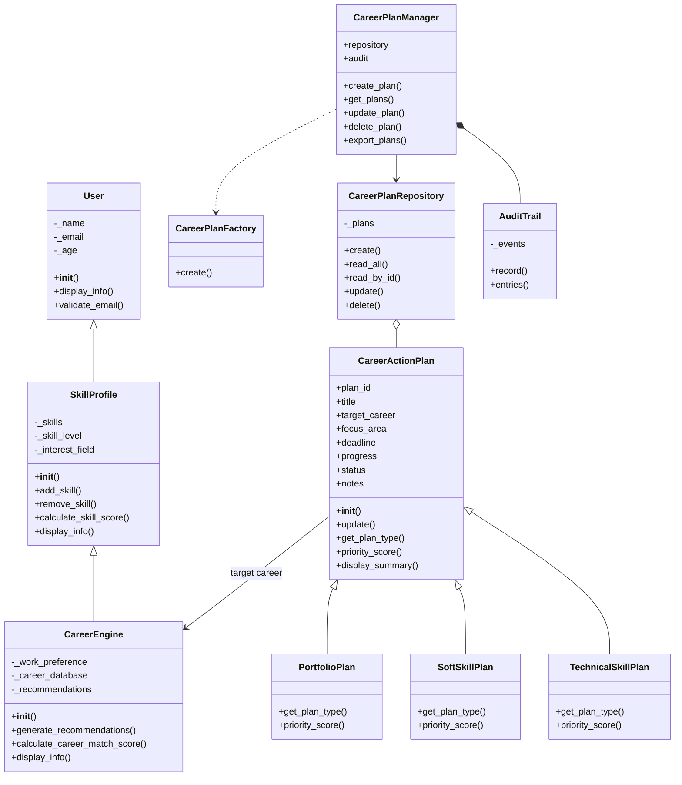

# LAPORAN EVALUASI AKHIR SEMESTER (EAS/UAS)
## PEMROGRAMAN BERORIENTASI OBJEK

---

## HALAMAN JUDUL

| | |
|---|---|
| **Judul Laporan** | Pengembangan Modul CRUD Career Action Plan pada Aplikasi CareerCompass AI Berbasis Pemrograman Berorientasi Objek |
| **Mata Kuliah** | Pemrograman Berorientasi Objek |
| **Jenis Evaluasi** | Evaluasi Akhir Semester (EAS/UAS) Individu |
| **Nama Mahasiswa** | Galih Aji Pangestu |
| **NPM** | 24081010123 |
| **Kelas** | OOP Class C |
| **Dosen Pengampu** | [NAMA DOSEN] |
| **Program Studi** | [NAMA PRODI] |
| **Universitas** | [NAMA UNIVERSITAS] |
| **Tanggal Pengumpulan** | 19 Juni 2026 |

> **[GAMBAR 1: Logo Universitas / Cover Depan Laporan]**  
> *Keterangan: Tempatkan logo universitas dan desain cover laporan di halaman pertama saat dirapikan di Microsoft Word.*

---

## HALAMAN PENGESAHAN

Laporan ini telah disusun sebagai salah satu syarat untuk menyelesaikan Evaluasi Akhir Semester mata kuliah Pemrograman Berorientasi Objek.

Malang, 19 Juni 2026

| Pihak | Nama | Tanda Tangan |
|---|---|---|
| Mahasiswa | Galih Aji Pangestu | ____________________ |
| Dosen Pengampu | [NAMA DOSEN] | ____________________ |

---

## ABSTRAK

Laporan ini membahas pengembangan modul **Career Action Plan CRUD** sebagai kelanjutan dari project Evaluasi Tengah Semester (UTS) berjudul **CareerCompass AI**. Pada project UTS, aplikasi berfokus pada rekomendasi karier berdasarkan skill, minat, level kemampuan, dan preferensi kerja. Pada pengembangan UAS, studi kasus diperluas menjadi **manajemen rencana aksi karier** agar pengguna tidak hanya mendapat rekomendasi, tetapi juga dapat mencatat, memantau, memperbarui, dan menghapus langkah tindak lanjut menuju karier yang dipilih.

Aplikasi dibangun menggunakan Python dan Streamlit. Modul UAS menerapkan operasi **Create, Read, Update, Delete (CRUD)**, konsep **polimorfisme**, serta minimal tiga hubungan antar class yaitu **Inheritance, Aggregation, Composition, Dependency, dan Association**. Hasil pengujian menunjukkan bahwa seluruh fitur CRUD berjalan sesuai kebutuhan dan konsep PBO dapat dijelaskan secara jelas melalui struktur class yang digunakan.

**Kata Kunci:** Pemrograman Berorientasi Objek, CRUD, Polimorfisme, Streamlit, Career Action Plan, CareerCompass AI

---

## DAFTAR ISI

> *Catatan: Generate otomatis di Microsoft Word setelah seluruh heading sudah dirapikan.*

| No | Bab | Halaman |
|---|---|---|
| | HALAMAN JUDUL | [HALAMAN] |
| | HALAMAN PENGESAHAN | [HALAMAN] |
| | ABSTRAK | [HALAMAN] |
| | DAFTAR ISI | [HALAMAN] |
| | DAFTAR GAMBAR | [HALAMAN] |
| | DAFTAR TABEL | [HALAMAN] |
| 1 | PENDAHULUAN | [HALAMAN] |
| 2 | LANDASAN TEORI | [HALAMAN] |
| 3 | ANALISIS SISTEM | [HALAMAN] |
| 4 | PERANCANGAN SISTEM | [HALAMAN] |
| 5 | IMPLEMENTASI DAN PEMBAHASAN | [HALAMAN] |
| 6 | PENGUJIAN APLIKASI | [HALAMAN] |
| 7 | DEMO VIDEO APLIKASI | [HALAMAN] |
| 8 | KESIMPULAN DAN SARAN | [HALAMAN] |
| | DAFTAR PUSTAKA | [HALAMAN] |
| | LAMPIRAN | [HALAMAN] |

---

## DAFTAR GAMBAR

| No | Judul Gambar | Halaman |
|---|---|---|
| Gambar 1 | Logo Universitas / Cover Depan Laporan | [HALAMAN] |
| Gambar 2 | Tampilan Halaman Utama Aplikasi CareerCompass AI | [HALAMAN] |
| Gambar 3 | Tampilan Tab UTS Recommendation System | [HALAMAN] |
| Gambar 4 | Tampilan Tab EAS CRUD Action Plan | [HALAMAN] |
| Gambar 5 | Fitur Create Data pada Modul CRUD | [HALAMAN] |
| Gambar 6 | Fitur Read Data pada Modul CRUD | [HALAMAN] |
| Gambar 7 | Fitur Update Data pada Modul CRUD | [HALAMAN] |
| Gambar 8 | Fitur Delete Data pada Modul CRUD | [HALAMAN] |
| Gambar 9 | Tab Konsep PBO pada Aplikasi | [HALAMAN] |
| Gambar 10 | Class Diagram Aplikasi UAS | [HALAMAN] |
| Gambar 11 | Use Case Diagram Modul CRUD | [HALAMAN] |
| Gambar 12 | Activity Diagram Operasi CRUD | [HALAMAN] |
| Gambar 13 | Screenshot Video Demo Aplikasi | [HALAMAN] |

---

## DAFTAR TABEL

| No | Judul Tabel | Halaman |
|---|---|---|
| Tabel 1 | Perbandingan Fitur UTS dan UAS | [HALAMAN] |
| Tabel 2 | Spesifikasi Perangkat Lunak dan Perangkat Keras | [HALAMAN] |
| Tabel 3 | Daftar Class Utama pada Modul UAS | [HALAMAN] |
| Tabel 4 | Mapping Fitur CRUD dengan Method Program | [HALAMAN] |
| Tabel 5 | Penerapan Polimorfisme pada Aplikasi | [HALAMAN] |
| Tabel 6 | Penerapan Hubungan Antar Class | [HALAMAN] |
| Tabel 7 | Struktur Data Career Action Plan | [HALAMAN] |
| Tabel 8 | Hasil Pengujian Fitur CRUD | [HALAMAN] |
| Tabel 9 | Checklist Pemenuhan Ketentuan UAS | [HALAMAN] |

---

# BAB 1 — PENDAHULUAN

## 1.1 Latar Belakang

Pada Evaluasi Tengah Semester (UTS), telah dikembangkan aplikasi **CareerCompass AI** yang berfungsi memberikan rekomendasi karier berdasarkan profil pengguna. Aplikasi tersebut menerapkan konsep **multilevel inheritance**, **constructor**, dan **method overriding** pada class `User`, `SkillProfile`, dan `CareerEngine`.

Meskipun rekomendasi karier sudah membantu pengguna mengetahui arah pekerjaan yang cocok, masih terdapat kebutuhan lanjutan, yaitu bagaimana pengguna mencatat dan mengelola langkah-langkah konkret menuju karier tersebut. Contohnya adalah belajar skill teknis, mempersiapkan soft skill, atau membangun portfolio project.

Oleh karena itu, pada Evaluasi Akhir Semester (UAS), project UTS dilanjutkan dengan menambahkan modul baru bernama **Career Action Plan CRUD**. Modul ini memungkinkan pengguna melakukan operasi **Create, Read, Update, dan Delete** terhadap data rencana aksi karier, sekaligus menerapkan konsep **polimorfisme** dan **hubungan antar class** sesuai ketentuan mata kuliah Pemrograman Berorientasi Objek.

## 1.2 Rumusan Masalah

Berdasarkan latar belakang di atas, rumusan masalah pada pengembangan UAS ini adalah:

1. Bagaimana melanjutkan studi kasus UTS menjadi aplikasi yang memiliki fitur CRUD?
2. Bagaimana menerapkan konsep polimorfisme pada modul pengelolaan rencana aksi karier?
3. Bagaimana menerapkan minimal tiga hubungan antar class pada sistem?
4. Bagaimana membuat aplikasi UAS yang berbeda dari project UTS namun tetap berada dalam satu studi kasus yang sama?

## 1.3 Batasan Masalah

Agar pengembangan terfokus, batasan masalah pada laporan ini adalah:

1. Aplikasi dikembangkan menggunakan bahasa pemrograman Python.
2. Antarmuka pengguna dibuat menggunakan framework Streamlit.
3. Data rencana aksi karier disimpan pada memori aplikasi (session state), bukan database eksternal.
4. Fokus utama laporan adalah penerapan konsep PBO, bukan keamanan sistem tingkat produksi.
5. Video demo dibuat terpisah sebagai bagian dari pengumpulan UAS.

## 1.4 Tujuan

Tujuan dari pengembangan aplikasi UAS ini adalah:

1. Melanjutkan project UTS dengan studi kasus yang lebih luas.
2. Mengimplementasikan fitur **Create, Read, Update, Delete** pada data rencana aksi karier.
3. Menerapkan konsep **polimorfisme** pada class turunan action plan.
4. Menerapkan minimal tiga hubungan antar class.
5. Menyediakan dokumentasi dan demo aplikasi yang dapat digunakan untuk evaluasi akhir semester.

## 1.5 Manfaat

Manfaat dari pengembangan aplikasi ini adalah:

1. Membantu mahasiswa memahami penerapan PBO pada aplikasi nyata.
2. Membantu pengguna menyusun rencana tindak lanjut setelah mendapat rekomendasi karier.
3. Menjadi contoh integrasi antara modul analisis (UTS) dan modul manajemen data (UAS).

---

# BAB 2 — LANDASAN TEORI

## 2.1 Pemrograman Berorientasi Objek (PBO)

Pemrograman Berorientasi Objek adalah paradigma pemrograman yang mengorganisasi program berdasarkan **object** yang memiliki **atribut** dan **method**. Konsep utama yang digunakan dalam aplikasi ini meliputi:

| Konsep | Penjelasan Singkat | Penerapan pada Aplikasi |
|---|---|---|
| Class | Blueprint atau cetakan object | `CareerActionPlan`, `CareerPlanManager` |
| Object | Instance dari class | Object plan teknis, soft skill, portfolio |
| Encapsulation | Pembatasan akses data internal | Atribut protected pada class `User` |
| Inheritance | Pewarisan atribut dan method | `CareerActionPlan` → `TechnicalSkillPlan` |
| Polymorphism | Satu interface, banyak implementasi | `get_plan_type()`, `priority_score()` |
| Abstraction | Menyembunyikan detail kompleks | Scoring rekomendasi karier |

## 2.2 CRUD (Create, Read, Update, Delete)

CRUD adalah empat operasi dasar dalam pengelolaan data:

| Operasi | Fungsi | Contoh pada Aplikasi |
|---|---|---|
| Create | Menambah data baru | Menambah rencana belajar Docker |
| Read | Membaca/menampilkan data | Menampilkan tabel action plan |
| Update | Memperbarui data | Mengubah progress dari 10% ke 40% |
| Delete | Menghapus data | Menghapus rencana yang sudah tidak relevan |

## 2.3 Polimorfisme

Polimorfisme terjadi ketika beberapa class memiliki method dengan nama yang sama, tetapi perilaku method tersebut berbeda. Pada aplikasi ini, class `TechnicalSkillPlan`, `SoftSkillPlan`, dan `PortfolioPlan` sama-sama memiliki method `get_plan_type()` dan `priority_score()`, namun hasilnya berbeda sesuai jenis rencana.

## 2.4 Hubungan Antar Class

Aplikasi menerapkan lima jenis hubungan antar class:

| Hubungan | Penjelasan | Contoh pada Aplikasi |
|---|---|---|
| Inheritance | Class anak mewarisi class induk | `TechnicalSkillPlan` mewarisi `CareerActionPlan` |
| Aggregation | Class menyimpan kumpulan object lain | `CareerPlanRepository` menyimpan banyak plan |
| Composition | Class memiliki bagian yang tidak dapat berdiri sendiri | `CareerPlanManager` memiliki `AuditTrail` |
| Dependency | Class menggunakan class lain secara sementara | `CareerPlanManager` memakai `CareerPlanFactory` |
| Association | Dua class saling berhubungan secara logis | `CareerActionPlan` terhubung ke target karier hasil `CareerEngine` |

---

# BAB 3 — ANALISIS SISTEM

## 3.1 Deskripsi Masalah Bisnis

Masalah bisnis yang diselesaikan pada modul UAS adalah:

> Pengguna sudah mendapat rekomendasi karier, tetapi belum memiliki sistem untuk mencatat, memantau, dan mengelola langkah-langkah persiapan menuju karier tersebut.

Contoh kebutuhan pengguna:

- Mahasiswa ingin menjadi Backend Developer, tetapi perlu mencatat rencana belajar Docker.
- Pengguna ingin mempersiapkan soft skill untuk interview.
- Pengguna ingin membuat portfolio project sebagai bukti kompetensi.

## 3.2 Perbandingan Studi Kasus UTS dan UAS

### Tabel 1 — Perbandingan Fitur UTS dan UAS

| Aspek | UTS (ETS) | UAS (EAS) |
|---|---|---|
| Judul Fokus | Career Recommendation System | Career Action Plan CRUD |
| Masalah Utama | Menentukan karier yang cocok | Mengelola rencana tindak lanjut karier |
| Fitur Utama | Rekomendasi karier berbasis skor | Create, Read, Update, Delete data rencana |
| Konsep PBO Utama | Multilevel inheritance, constructor, overriding | Polimorfisme, hubungan antar class, CRUD |
| Class Inti | `User`, `SkillProfile`, `CareerEngine` | `CareerActionPlan`, `CareerPlanManager`, `CareerPlanRepository` |
| Output | Rekomendasi karier dan analisis skill gap | Data rencana aksi karier dan audit log CRUD |
| Tab Aplikasi | UTS Recommendation System | EAS CRUD Action Plan |

Dengan perbandingan di atas, aplikasi UAS tetap melanjutkan project UTS, tetapi memiliki studi kasus dan fitur yang berbeda sehingga memenuhi ketentuan "antar mahasiswa tidak boleh sama aplikasinya".

## 3.3 Aktor Sistem

| Aktor | Peran |
|---|---|
| Pengguna / Mahasiswa | Mengisi profil, melihat rekomendasi, mengelola data action plan |
| CareerEngine | Menghasilkan rekomendasi karier dari modul UTS |
| CareerPlanManager | Mengelola operasi CRUD pada modul UAS |
| CareerPlanRepository | Menyimpan data action plan |
| AuditTrail | Mencatat aktivitas create, update, delete |

## 3.4 Kebutuhan Fungsional

| Kode | Kebutuhan | Keterangan |
|---|---|---|
| F1 | Create Data | Pengguna dapat menambah rencana aksi karier |
| F2 | Read Data | Pengguna dapat melihat seluruh data rencana aksi |
| F3 | Update Data | Pengguna dapat memperbarui data rencana aksi |
| F4 | Delete Data | Pengguna dapat menghapus data rencana aksi |
| F5 | Polimorfisme | Sistem membuat object plan sesuai tipe yang dipilih |
| F6 | Audit Trail | Sistem mencatat aktivitas CRUD |
| F7 | Export Data | Pengguna dapat mengunduh data dalam format JSON |

## 3.5 Kebutuhan Non-Fungsional

| Kode | Kebutuhan | Keterangan |
|---|---|---|
| NF1 | Kemudahan Penggunaan | Antarmuka berbasis tab dan form |
| NF2 | Validasi Input | Form create memvalidasi judul dan fokus area |
| NF3 | Keterbacaan Kode | Struktur class terpisah dan terdokumentasi |
| NF4 | Kompatibilitas | Dapat dijalankan di Python 3 dengan virtual environment |

---

# BAB 4 — PERANCANGAN SISTEM

## 4.1 Arsitektur Aplikasi

Aplikasi terdiri dari dua modul utama:

1. **Modul UTS** — Career Recommendation System
2. **Modul UAS** — Career Action Plan CRUD

Alur kerja aplikasi:

```
Pengguna
   │
   ├─► Sidebar: Input Profil
   │
   ├─► Tab 1: UTS Recommendation System
   │        └─► CareerEngine.generate_recommendations()
   │
   └─► Tab 2: EAS CRUD Action Plan
            ├─► Create
            ├─► Read
            ├─► Update
            ├─► Delete
            └─► Konsep PBO
```

> **[GAMBAR 2: Tampilan Halaman Utama Aplikasi CareerCompass AI]**  
> *Keterangan: Screenshot halaman utama aplikasi yang menampilkan judul "CareerCompass AI + Career Action Plan" dan dua tab utama.*

## 4.2 Use Case Diagram

> **[GAMBAR 11: Use Case Diagram Modul CRUD]**  
> *Keterangan: Buat diagram use case dengan aktor "Pengguna" dan use case: Create Action Plan, Read Action Plan, Update Action Plan, Delete Action Plan, View OOP Concepts, Export Data.*

Contoh use case utama:

| Use Case | Aktor | Deskripsi |
|---|---|---|
| Create Action Plan | Pengguna | Menambahkan data rencana aksi karier baru |
| Read Action Plan | Pengguna | Melihat daftar rencana aksi karier |
| Update Action Plan | Pengguna | Mengubah data rencana aksi karier |
| Delete Action Plan | Pengguna | Menghapus data rencana aksi karier |
| Export Action Plan | Pengguna | Mengunduh data dalam format JSON |

## 4.3 Activity Diagram CRUD

> **[GAMBAR 12: Activity Diagram Operasi CRUD]**  
> *Keterangan: Buat activity diagram yang menggambarkan alur create → read → update → delete pada modul Career Action Plan.*

## 4.4 Class Diagram

### Tabel 3 — Daftar Class Utama pada Modul UAS

| No | Nama Class | Peran | Relasi Utama |
|---|---|---|---|
| 1 | `CareerActionPlan` | Entity dasar rencana aksi | Diwarisi oleh 3 class turunan |
| 2 | `TechnicalSkillPlan` | Rencana skill teknis | Inheritance dari `CareerActionPlan` |
| 3 | `SoftSkillPlan` | Rencana soft skill | Inheritance dari `CareerActionPlan` |
| 4 | `PortfolioPlan` | Rencana portfolio project | Inheritance dari `CareerActionPlan` |
| 5 | `CareerPlanFactory` | Membuat object plan sesuai tipe | Dependency |
| 6 | `CareerPlanRepository` | Penyimpanan data CRUD | Aggregation |
| 7 | `AuditTrail` | Pencatatan aktivitas CRUD | Composition |
| 8 | `CareerPlanManager` | Service utama modul UAS | Composition, Dependency, Aggregation |

### Class Diagram (Mermaid)



> **[GAMBAR 10: Class Diagram Aplikasi UAS]**  
> *Keterangan: Export diagram class di atas ke gambar PNG/SVG dan sisipkan ke laporan Word. Bisa dibuat menggunakan draw.io, StarUML, atau Mermaid Live Editor.*

## 4.5 Struktur Data

### Tabel 7 — Struktur Data Career Action Plan

| Field | Tipe Data | Keterangan | Contoh |
|---|---|---|---|
| `plan_id` | String | ID unik rencana aksi | `a1b2c3d4` |
| `title` | String | Judul rencana | Belajar Docker untuk Backend Developer |
| `target_career` | String | Karier tujuan | Backend Developer |
| `focus_area` | String | Area fokus pengembangan | Docker, deployment, CI/CD |
| `deadline` | String / Date | Batas waktu rencana | 2026-07-15 |
| `progress` | Integer | Progress 0–100 | 40 |
| `status` | String | Status rencana | In Progress |
| `notes` | String | Catatan tambahan | Sudah menyelesaikan dasar Docker |

## 4.6 Spesifikasi Teknis

### Tabel 2 — Spesifikasi Perangkat Lunak dan Perangkat Keras

| Komponen | Spesifikasi |
|---|---|
| Bahasa Pemrograman | Python 3.x |
| Framework GUI | Streamlit |
| Library Pendukung | Pandas, Plotly |
| Editor / IDE | Visual Studio Code / Cursor |
| Sistem Operasi | Windows 10/11 |
| Perangkat Keras Minimum | Laptop/PC dengan RAM 8 GB |
| Cara Menjalankan | `.venv\Scripts\python.exe -m streamlit run career_system.py` |

---

# BAB 5 — IMPLEMENTASI DAN PEMBAHASAN

## 5.1 Struktur File Project

```
ets-oop/
├── career_system.py                  # File utama aplikasi
├── requirements.txt                  # Daftar dependency
├── README.md                         # Panduan singkat project
├── LAPORAN_UTS_CAREERCOMPASS.md      # Laporan UTS
├── LAPORAN_UAS_CAREER_ACTION_PLAN.md # Laporan UAS (file ini)
├── SCRIPT_VIDEO_DEMO_UAS.md          # Naskah demo video
└── .venv/                            # Virtual environment Python
```

## 5.2 Lokasi Fitur CRUD pada Aplikasi

Fitur CRUD berada pada:

**Tab utama:** `EAS CRUD Action Plan`

Di dalam tab tersebut terdapat sub-tab:

| Sub-tab | Fungsi |
|---|---|
| Create | Menambah data rencana aksi karier |
| Read | Menampilkan data dan log aktivitas CRUD |
| Update | Memperbarui data berdasarkan `plan_id` |
| Delete | Menghapus data dengan konfirmasi |
| Konsep PBO | Penjelasan polimorfisme dan relasi antar class |

> **[GAMBAR 4: Tampilan Tab EAS CRUD Action Plan]**  
> *Keterangan: Screenshot tab EAS CRUD Action Plan yang menampilkan sub-tab Create, Read, Update, Delete, dan Konsep PBO.*

## 5.3 Implementasi Fitur CRUD

### Tabel 4 — Mapping Fitur CRUD dengan Method Program

| Fitur UI | Method / Class | Penjelasan |
|---|---|---|
| Create Data | `CareerPlanManager.create_plan()` | Membuat object plan melalui factory, menyimpan ke repository, mencatat audit |
| Read Data | `CareerPlanManager.get_plans()` | Membaca seluruh object plan dari repository |
| Update Data | `CareerPlanManager.update_plan()` | Memperbarui object berdasarkan `plan_id` |
| Delete Data | `CareerPlanManager.delete_plan()` | Menghapus object dari repository |
| Export JSON | `CareerPlanManager.export_plans()` | Mengekspor data ke format JSON |
| Audit Log | `AuditTrail.record()` | Mencatat aktivitas create, update, delete |

### 5.3.1 Create Data

**Lokasi UI:** Tab `EAS CRUD Action Plan` → Sub-tab `Create`

**Alur kerja:**

1. Pengguna mengisi form rencana aksi.
2. Sistem memvalidasi input.
3. `CareerPlanFactory` membuat object sesuai tipe rencana.
4. Object disimpan ke `CareerPlanRepository`.
5. Aktivitas dicatat ke `AuditTrail`.

**Cuplikan kode:**

```python
def create_plan(self, plan_type, title, target_career, focus_area, deadline, progress, status, notes):
    plan = CareerPlanFactory.create(plan_type, title, target_career, focus_area, deadline, progress, status, notes=notes)
    self.repository.create(plan)
    self.audit.record("CREATE", plan.title)
    return plan
```

> **[GAMBAR 5: Fitur Create Data pada Modul CRUD]**  
> *Keterangan: Screenshot form Create yang sudah diisi, misalnya rencana "Belajar Docker untuk Backend Developer".*

### 5.3.2 Read Data

**Lokasi UI:** Tab `EAS CRUD Action Plan` → Sub-tab `Read`

**Alur kerja:**

1. Sistem membaca seluruh object plan dari repository.
2. Setiap object memanggil `display_summary()`.
3. Data ditampilkan dalam tabel menggunakan `pandas.DataFrame`.
4. Pengguna dapat mengunduh data dalam format JSON.

**Cuplikan kode:**

```python
def get_plans(self) -> list:
    return self.repository.read_all()
```

> **[GAMBAR 6: Fitur Read Data pada Modul CRUD]**  
> *Keterangan: Screenshot tabel data action plan dan log aktivitas CRUD.*

### 5.3.3 Update Data

**Lokasi UI:** Tab `EAS CRUD Action Plan` → Sub-tab `Update`

**Alur kerja:**

1. Pengguna memilih data berdasarkan `plan_id`.
2. Form terisi otomatis dengan data lama.
3. Pengguna mengubah field yang diperlukan.
4. Sistem memperbarui object melalui method `update()`.
5. Aktivitas update dicatat ke audit trail.

**Cuplikan kode:**

```python
def update_plan(self, plan_id, title, target_career, focus_area, deadline, progress, status, notes):
    plan = self.repository.update(plan_id, title, target_career, focus_area, deadline, progress, status, notes)
    if plan:
        self.audit.record("UPDATE", plan.title)
    return plan
```

> **[GAMBAR 7: Fitur Update Data pada Modul CRUD]**  
> *Keterangan: Screenshot form update dengan contoh perubahan progress dari 10% menjadi 40%.*

### 5.3.4 Delete Data

**Lokasi UI:** Tab `EAS CRUD Action Plan` → Sub-tab `Delete`

**Alur kerja:**

1. Pengguna memilih data yang akan dihapus.
2. Sistem menampilkan detail data terpilih.
3. Pengguna mencentang konfirmasi penghapusan.
4. Data dihapus dari repository.
5. Aktivitas delete dicatat ke audit trail.

**Cuplikan kode:**

```python
def delete_plan(self, plan_id) -> bool:
    plan = self.repository.read_by_id(plan_id)
    title = plan.title if plan else "Unknown"
    deleted = self.repository.delete(plan_id)
    if deleted:
        self.audit.record("DELETE", title)
    return deleted
```

> **[GAMBAR 8: Fitur Delete Data pada Modul CRUD]**  
> *Keterangan: Screenshot tab Delete dengan checkbox konfirmasi dan data yang akan dihapus.*

## 5.4 Penerapan Polimorfisme

Polimorfisme diterapkan pada class `CareerActionPlan` dan tiga class turunannya.

### Tabel 5 — Penerapan Polimorfisme pada Aplikasi

| Class | Method | Hasil / Perilaku |
|---|---|---|
| `CareerActionPlan` | `get_plan_type()` | Mengembalikan `"General"` |
| `TechnicalSkillPlan` | `get_plan_type()` | Mengembalikan `"Technical Skill"` |
| `SoftSkillPlan` | `get_plan_type()` | Mengembalikan `"Soft Skill"` |
| `PortfolioPlan` | `get_plan_type()` | Mengembalikan `"Portfolio Project"` |
| `CareerActionPlan` | `priority_score()` | `max(1, 100 - progress)` |
| `TechnicalSkillPlan` | `priority_score()` | `max(1, 120 - progress)` |
| `SoftSkillPlan` | `priority_score()` | `max(1, 90 - progress)` |
| `PortfolioPlan` | `priority_score()` | `max(1, 110 - progress)` |

**Cuplikan kode polimorfisme:**

```python
class TechnicalSkillPlan(CareerActionPlan):
    def get_plan_type(self) -> str:
        return "Technical Skill"

    def priority_score(self) -> int:
        return max(1, 120 - self.progress)
```

**Pembahasan:**

Ketika aplikasi menampilkan data menggunakan `plan.display_summary()`, method `get_plan_type()` dan `priority_score()` dipanggil secara seragam pada object yang berbeda. Inilah bentuk polimorfisme, karena satu method dapat memiliki implementasi berbeda tergantung jenis object.

## 5.5 Penerapan Hubungan Antar Class

### Tabel 6 — Penerapan Hubungan Antar Class

| No | Hubungan | Class Terkait | Penjelasan |
|---|---|---|---|
| 1 | Inheritance | `CareerActionPlan` → `TechnicalSkillPlan` | Class anak mewarisi atribut dan method class induk |
| 2 | Inheritance | `CareerActionPlan` → `SoftSkillPlan` | Class anak mewarisi atribut dan method class induk |
| 3 | Inheritance | `CareerActionPlan` → `PortfolioPlan` | Class anak mewarisi atribut dan method class induk |
| 4 | Aggregation | `CareerPlanRepository` → `CareerActionPlan` | Repository menyimpan kumpulan object plan |
| 5 | Composition | `CareerPlanManager` → `AuditTrail` | AuditTrail menjadi bagian internal manager |
| 6 | Dependency | `CareerPlanManager` → `CareerPlanFactory` | Manager meminta factory membuat object plan |
| 7 | Association | `CareerActionPlan` → `CareerEngine` | Field `target_career` terhubung ke hasil rekomendasi karier |

**Pembahasan singkat:**

- **Inheritance** digunakan agar setiap jenis rencana aksi memiliki struktur dasar yang sama.
- **Aggregation** digunakan agar repository dapat menyimpan banyak object plan.
- **Composition** digunakan agar audit trail selalu menjadi bagian dari manager.
- **Dependency** digunakan agar manager tidak perlu tahu detail pembuatan object plan.
- **Association** digunakan agar rencana aksi terhubung dengan karier hasil rekomendasi UTS.

> **[GAMBAR 9: Tab Konsep PBO pada Aplikasi]**  
> *Keterangan: Screenshot tab Konsep PBO yang menampilkan penjelasan polimorfisme dan hubungan antar class.*

## 5.6 Rangkuman Source Code Secara Keseluruhan

File utama aplikasi adalah `career_system.py`. Secara keseluruhan, source code dibagi menjadi beberapa bagian:

| Bagian | Fungsi |
|---|---|
| Konstanta data | Menyimpan skill, interest field, bobot skill, dan learning resources |
| Class UTS | `User`, `SkillProfile`, `CareerEngine` untuk rekomendasi karier |
| Class UAS | `CareerActionPlan`, factory, repository, manager, audit trail |
| UI helper | Fungsi render profil, grafik, rekomendasi, dan modul CRUD |
| Fungsi `main()` | Menghubungkan sidebar, tab UTS, dan tab UAS |

Alur integrasi UTS dan UAS:

1. Pengguna mengisi profil di sidebar.
2. `CareerEngine` menghasilkan rekomendasi karier.
3. Hasil rekomendasi digunakan sebagai pilihan `target_career` pada modul CRUD.
4. Pengguna membuat dan mengelola rencana aksi karier berdasarkan rekomendasi tersebut.

> **[GAMBAR 3: Tampilan Tab UTS Recommendation System]**  
> *Keterangan: Screenshot hasil rekomendasi karier, termasuk top recommendation dan score breakdown.*

---

# BAB 6 — PENGUJIAN APLIKASI

## 6.1 Metode Pengujian

Pengujian dilakukan secara manual dengan skenario penggunaan langsung pada aplikasi Streamlit. Setiap fitur CRUD diuji untuk memastikan data dapat dibuat, dibaca, diperbarui, dan dihapus dengan benar.

## 6.2 Skenario Pengujian

### Tabel 8 — Hasil Pengujian Fitur CRUD

| No | Skenario Uji | Langkah Uji | Hasil Diharapkan | Hasil Aktual | Status |
|---|---|---|---|---|---|
| 1 | Create data valid | Isi form Create lalu klik Create Data | Data baru muncul di tab Read | [ISI SETELAH UJI] | [ ] |
| 2 | Create data tidak valid | Kosongkan judul/fokus area | Muncul pesan error validasi | [ISI SETELAH UJI] | [ ] |
| 3 | Read data | Buka tab Read setelah create | Tabel menampilkan data action plan | [ISI SETELAH UJI] | [ ] |
| 4 | Update data | Ubah progress dan status lalu update | Data berubah di tabel Read | [ISI SETELAH UJI] | [ ] |
| 5 | Delete data | Pilih data, centang konfirmasi, delete | Data hilang dari tabel Read | [ISI SETELAH UJI] | [ ] |
| 6 | Export JSON | Klik Download Data CRUD (JSON) | File JSON terunduh | [ISI SETELAH UJI] | [ ] |
| 7 | Audit trail | Lakukan create, update, delete | Log aktivitas tercatat | [ISI SETELAH UJI] | [ ] |
| 8 | Polimorfisme | Buat 3 tipe plan berbeda | Kolom Type dan Priority berbeda | [ISI SETELAH UJI] | [ ] |

> *Isi kolom "Hasil Aktual" dan centang "Status" setelah kamu melakukan pengujian manual.*

## 6.3 Pengujian Sintaks Program

Perintah yang digunakan:

```bash
.venv\Scripts\python.exe -m py_compile career_system.py
```

Hasil:

| Item | Keterangan |
|---|---|
| File yang diuji | `career_system.py` |
| Exit Code | `0` |
| Kesimpulan | Tidak ada error sintaks |

---

# BAB 7 — DEMO VIDEO APLIKASI

## 7.1 Informasi Video

| Item | Keterangan |
|---|---|
| Judul Video | Demo Aplikasi UAS — CareerCompass AI + Career Action Plan CRUD |
| Durasi | [DURASI VIDEO, misalnya 5–10 menit] |
| Format File | [MP4 / MKV / LINK YOUTUBE / LINK GOOGLE DRIVE] |
| Link Video | [TEMPEL LINK VIDEO DI SINI] |
| Tanggal Rekaman | [TANGGAL REKAM] |

> **[GAMBAR 13: Screenshot Video Demo Aplikasi]**  
> *Keterangan: Sisipkan thumbnail atau screenshot dari video demo. Jika video diunggah ke YouTube/Drive, cantumkan juga QR code atau link.*

## 7.2 Isi yang Wajib Dijelaskan dalam Video

1. Perkenalan nama, NPM, kelas, dan judul aplikasi.
2. Cara menjalankan aplikasi.
3. Demo fitur rekomendasi karier (modul UTS).
4. Demo fitur **Create** pada modul CRUD.
5. Demo fitur **Read** pada modul CRUD.
6. Demo fitur **Update** pada modul CRUD.
7. Demo fitur **Delete** pada modul CRUD.
8. Penjelasan konsep **polimorfisme**.
9. Penjelasan minimal 3 hubungan antar class.
10. Penutup dan kesimpulan.

Naskah lengkap demo video tersedia di file:

`SCRIPT_VIDEO_DEMO_UAS.md`

---

# BAB 8 — KESIMPULAN DAN SARAN

## 8.1 Kesimpulan

Berdasarkan hasil analisis, perancangan, implementasi, dan pengujian, dapat disimpulkan bahwa:

1. Aplikasi UAS berhasil melanjutkan project UTS dengan studi kasus yang lebih luas.
2. Modul **Career Action Plan CRUD** telah mengimplementasikan fitur create, read, update, dan delete.
3. Konsep **polimorfisme** diterapkan melalui class `TechnicalSkillPlan`, `SoftSkillPlan`, dan `PortfolioPlan`.
4. Aplikasi menerapkan lebih dari tiga hubungan antar class, yaitu inheritance, aggregation, composition, dependency, dan association.
5. Aplikasi UAS memiliki fokus yang berbeda dari UTS sehingga memenuhi ketentuan individu.

## 8.2 Saran Pengembangan

Beberapa saran untuk pengembangan selanjutnya:

1. Menyimpan data action plan ke database permanen seperti SQLite atau MySQL.
2. Menambahkan fitur login agar setiap pengguna memiliki data terpisah.
3. Menambahkan reminder deadline otomatis.
4. Menambahkan grafik progress rencana aksi karier.
5. Memisahkan modul UTS dan UAS ke dalam file Python terpisah untuk maintainability yang lebih baik.

## 8.3 Checklist Pemenuhan Ketentuan UAS

### Tabel 9 — Checklist Pemenuhan Ketentuan UAS

| No | Ketentuan UAS | Status | Bukti |
|---|---|---|---|
| 1 | Melanjutkan studi kasus UTS | ✅ | Modul rekomendasi karier tetap ada |
| 2 | Create data | ✅ | Tab Create pada EAS CRUD Action Plan |
| 3 | Read data | ✅ | Tab Read pada EAS CRUD Action Plan |
| 4 | Update data | ✅ | Tab Update pada EAS CRUD Action Plan |
| 5 | Delete data | ✅ | Tab Delete pada EAS CRUD Action Plan |
| 6 | Polimorfisme | ✅ | `get_plan_type()`, `priority_score()` |
| 7 | Minimal 3 hubungan antar class | ✅ | 5 hubungan diterapkan |
| 8 | Video demo aplikasi | ⬜ | [TEMPEL LINK VIDEO] |
| 9 | Aplikasi berbeda dari teman | ✅ | Studi kasus action plan CRUD |
| 10 | Deadline 19 Juni 2026 | ⬜ | [ISI TANGGAL PENGUMPULAN] |

---

# DAFTAR PUSTAKA

1. Sommerville, I. (2016). *Software Engineering*. Pearson.
2. Python Software Foundation. (2024). *Python Documentation*. https://docs.python.org/3/
3. Streamlit Inc. (2024). *Streamlit Documentation*. https://docs.streamlit.io/
4. Gamma, E., Helm, R., Johnson, R., & Vlissides, J. (1994). *Design Patterns: Elements of Reusable Object-Oriented Software*. Addison-Wesley.
5. [TAMBAHKAN REFERENSI MATA KULIAH / BUKU PBO KAMPUS]

---

# LAMPIRAN

## Lampiran A — Cara Menjalankan Aplikasi

```bash
pip install -r requirements.txt
.venv\Scripts\python.exe -m streamlit run career_system.py
```

Buka browser pada:

`http://localhost:8501`

## Lampiran B — Contoh Data Create

| Field | Nilai Contoh |
|---|---|
| Judul Rencana | Belajar Docker untuk Backend Developer |
| Tipe Rencana | Technical Skill |
| Target Karier | Backend Developer |
| Fokus Area | Docker, deployment, CI/CD |
| Deadline | 2026-07-15 |
| Progress | 10 |
| Status | Planned |
| Catatan | Menyelesaikan roadmap Docker dan membuat mini project |

## Lampiran C — Contoh Output JSON

```json
[
  {
    "ID": "a1b2c3d4",
    "Type": "Technical Skill",
    "Title": "Belajar Docker untuk Backend Developer",
    "Target Career": "Backend Developer",
    "Focus Area": "Docker, deployment, CI/CD",
    "Deadline": "2026-07-15",
    "Progress": "40%",
    "Status": "In Progress",
    "Priority": 80,
    "Notes": "Sudah menyelesaikan dasar Docker"
  }
]
```

## Lampiran D — Cuplikan Source Code Class UAS

```python
class CareerPlanManager:
    def __init__(self, repository=None):
        self.repository = repository or CareerPlanRepository()
        self.audit = AuditTrail()

    def create_plan(self, plan_type, title, target_career, focus_area, deadline, progress, status, notes):
        plan = CareerPlanFactory.create(plan_type, title, target_career, focus_area, deadline, progress, status, notes=notes)
        self.repository.create(plan)
        self.audit.record("CREATE", plan.title)
        return plan
```

## Lampiran E — Daftar Placeholder yang Perlu Kamu Lengkapi di Word

| Placeholder | Yang Perlu Diisi |
|---|---|
| `[NAMA DOSEN]` | Nama dosen pengampu |
| `[NAMA PRODI]` | Nama program studi |
| `[NAMA UNIVERSITAS]` | Nama universitas |
| `[HALAMAN]` | Nomor halaman setelah dirapikan di Word |
| `[GAMBAR 1]` s/d `[GAMBAR 13]` | Screenshot / diagram pendukung |
| `[TEMPEL LINK VIDEO]` | Link video demo UAS |
| `[DURASI VIDEO]` | Durasi video demo |
| `[TANGGAL REKAM]` | Tanggal perekaman video |
| `[ISI SETELAH UJI]` | Hasil pengujian manual |
| `[TAMBAHKAN REFERENSI...]` | Referensi tambahan sesuai format kampus |

---

**Dibuat oleh:**  
Galih Aji Pangestu  
NPM 24081010123  
OOP Class C
