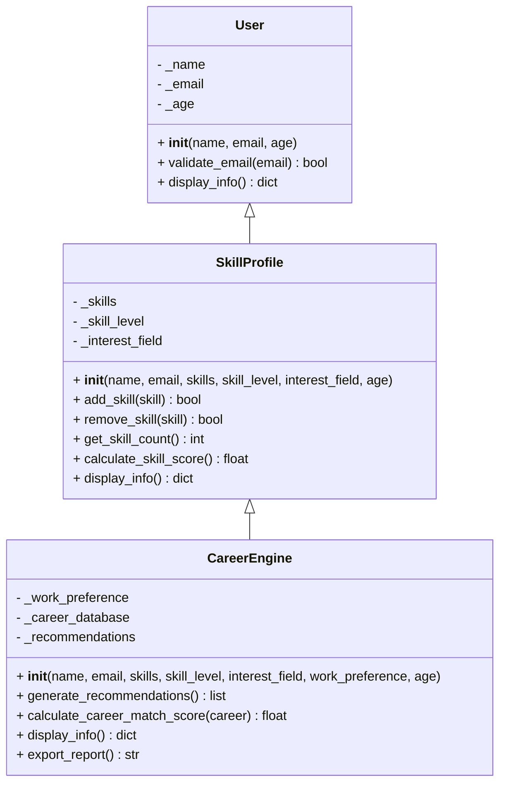

# LAPORAN EVALUASI TENGAH SEMESTER
## Aplikasi CareerCompass AI

**Nama**: Galih Aji Pangestu  
**NPM**: 24081010123  
**Kelas**: OOP Class C  
**Mata Kuliah**: Evaluasi Tengah Semester / UTS  
**Bentuk Aplikasi**: GUI berbasis Streamlit  
**Judul Aplikasi**: CareerCompass AI - Career Recommendation System

---

## 1. Deskripsi Masalah / Bisnis yang Diselesaikan

Banyak mahasiswa kesulitan menentukan arah karier karena tidak mengetahui hubungan antara skill yang dimiliki, minat bidang, dan jenis pekerjaan yang cocok. Di sisi lain, dunia kerja membutuhkan kandidat yang sesuai dengan kebutuhan kompetensi tertentu.

Aplikasi **CareerCompass AI** dirancang untuk membantu pengguna melakukan analisis karier secara cepat berdasarkan:

- daftar skill yang dimiliki,
- level kemampuan,
- bidang minat,
- preferensi kerja (remote, hybrid, office).

Masalah bisnis yang diselesaikan oleh aplikasi ini adalah:

1. membantu pengguna menemukan rekomendasi karier yang relevan,
2. memberi gambaran skill apa yang sudah sesuai dan apa yang masih perlu dikembangkan,
3. menyediakan penilaian berbasis skor untuk membandingkan beberapa pilihan karier,
4. mempermudah proses eksplorasi karier dengan tampilan GUI yang sederhana.

Dengan aplikasi ini, proses penentuan arah karier tidak lagi berdasarkan tebakan, tetapi berdasarkan data input pengguna dan sistem scoring terstruktur.

---

## 2. Tujuan Aplikasi

Tujuan pembuatan aplikasi CareerCompass AI adalah:

- menerapkan konsep **multilevel inheritance** pada studi kasus nyata,
- menerapkan **constructor** pada setiap class utama,
- menerapkan **overriding method** untuk memperluas fungsi class induk,
- membangun aplikasi GUI yang dapat digunakan untuk rekomendasi karier,
- menghasilkan output rekomendasi yang informatif dan mudah dipahami.

---

## 3. Ringkasan Aplikasi

Aplikasi ini dibangun menggunakan Python dan Streamlit. Pengguna memasukkan data diri, skill, tingkat kemampuan, bidang minat, dan preferensi kerja. Sistem kemudian menghitung skor kecocokan terhadap beberapa career path yang tersedia di database.

Output yang dihasilkan berupa:

- profil pengguna,
- rekomendasi karier teratas,
- grafik skor per karier,
- daftar rekomendasi lain,
- ringkasan skill yang cocok dan skill yang perlu dikembangkan.

---

## 4. Struktur Konsep OOP yang Diterapkan

### 4.1 Multilevel Inheritance

Struktur inheritance yang digunakan adalah:

**User → SkillProfile → CareerEngine**

Artinya:

- `User` adalah class dasar yang menyimpan data identitas pengguna,
- `SkillProfile` mewarisi `User` dan menambahkan informasi skill serta minat,
- `CareerEngine` mewarisi `SkillProfile` dan menambahkan logika rekomendasi karier.

#### Penjelasan singkat

- `User` menyimpan data dasar seperti nama dan email.
- `SkillProfile` menambahkan daftar skill, level skill, dan bidang minat.
- `CareerEngine` menambahkan database karier, scoring, dan rekomendasi hasil analisis.

#### Class Diagram



**Gambar yang perlu ditambahkan di bagian ini:**

- **Gambar 1**: Screenshot class diagram hasil render Mermaid atau class diagram yang dibuat manual di draw.io / diagrams.net.
- Letakkan setelah subbagian **Class Diagram**.

---

### 4.2 Constructor

Constructor digunakan untuk menginisialisasi data awal setiap object.

#### Constructor pada `User`

Fungsi constructor pada class `User`:

```python
def __init__(self, name: str, email: str, age: Optional[int] = None):
    self.name = name
    self.email = email
    self._age = age
```

Penjelasan:

- `self.name = name` memanggil setter untuk validasi nama,
- `self.email = email` memanggil setter untuk validasi email,
- `self._age = age` menyimpan umur sebagai atribut opsional.

#### Constructor pada `SkillProfile`

```python
def __init__(self, name, email, skills, skill_level, interest_field, age=None):
    super().__init__(name, email, age)
    self._skills = list(skills)
    self._skill_level = skill_level
    self._interest_field = interest_field
```

Penjelasan:

- `super().__init__(name, email, age)` memanggil constructor class `User`,
- `self._skills` menyimpan daftar skill,
- `self._skill_level` menyimpan level kemampuan,
- `self._interest_field` menyimpan bidang minat.

#### Constructor pada `CareerEngine`

```python
def __init__(self, name, email, skills, skill_level, interest_field, work_preference, age=None):
    super().__init__(name, email, skills, skill_level, interest_field, age)
    self._work_preference = work_preference
    self._career_database = self._load_career_database()
    self._recommendations = []
```

Penjelasan:

- `super().__init__(...)` memanggil constructor `SkillProfile`,
- `self._work_preference` menyimpan preferensi kerja,
- `self._career_database` berisi daftar karier yang akan dianalisis,
- `self._recommendations` menampung hasil rekomendasi.

**Gambar yang perlu ditambahkan di bagian ini:**

- **Gambar 2**: Screenshot potongan kode constructor pada class `User`.
- **Gambar 3**: Screenshot potongan kode constructor pada class `SkillProfile`.
- **Gambar 4**: Screenshot potongan kode constructor pada class `CareerEngine`.

Letakkan gambar tepat setelah masing-masing subjudul constructor.

---

### 4.3 Overriding Method

Overriding method terjadi ketika method pada class anak memiliki nama yang sama dengan method pada class induk, tetapi isi fungsinya diperluas atau diubah.

#### Overriding pada `display_info()`

##### Pada `User`

```python
def display_info(self) -> dict:
    """Return basic user information. Designed to be OVERRIDDEN."""
    info = {"name": self._name, "email": self._email}
    if self._age:
        info["age"] = self._age
    return info
```

##### Pada `SkillProfile`

```python
def display_info(self) -> dict:
    """Override: calls super().display_info() then adds skill fields."""
    info = super().display_info()
    info.update({
        "skills": self._skills, "skill_count": self.get_skill_count(),
        "skill_level": self._skill_level, "interest_field": self._interest_field,
        "skill_score": self.calculate_skill_score()
    })
    return info
```

##### Pada `CareerEngine`

```python
def display_info(self) -> dict:
    """Override: calls super().display_info() then adds career insights."""
    info = super().display_info()
    info["work_preference"] = self._work_preference
    info["recommendations_count"] = len(self._recommendations)
    if self._recommendations:
        info["top_career"] = self._recommendations[0]["name"]
        info["top_score"] = self._recommendations[0]["score"]
    return info
```

Penjelasan:

- `User.display_info()` hanya menampilkan data dasar,
- `SkillProfile.display_info()` menambahkan data skill,
- `CareerEngine.display_info()` menambahkan data hasil rekomendasi.

Ini menunjukkan konsep **polymorphism melalui overriding**.

**Gambar yang perlu ditambahkan di bagian ini:**

- **Gambar 5**: Screenshot potongan kode `display_info()` pada `User`.
- **Gambar 6**: Screenshot potongan kode `display_info()` pada `SkillProfile`.
- **Gambar 7**: Screenshot potongan kode `display_info()` pada `CareerEngine`.

---

## 5. Penjelasan Source Code Secara Keseluruhan

Bagian ini menjelaskan source code aplikasi blok demi blok agar mudah dipahami saat presentasi atau penilaian.

### 5.1 Blok Import dan Konstanta

**Lokasi file:** [career_system.py](career_system.py#L1)

Blok ini berisi import library yang digunakan, seperti:

- `streamlit` untuk GUI,
- `re` untuk validasi regex,
- `time` untuk simulasi loading,
- `json` untuk export data,
- `pandas` dan `plotly` untuk visualisasi.

Contoh potongan kode:

```python
import streamlit as st
import re
import time
import json
import pandas as pd
import plotly.graph_objects as go
from typing import List, Dict, Optional
```

Di bawahnya terdapat konstanta seperti:

- `AVAILABLE_SKILLS`,
- `INTEREST_FIELDS`,
- `SKILL_WEIGHTS`,
- `LEVEL_MATRIX`.

**Gambar yang perlu ditambahkan:**

- **Gambar 8**: Screenshot blok import dan konstanta.

---

### 5.2 Blok Class `User`

**Lokasi file:** [career_system.py](career_system.py#L80)

Class ini adalah class dasar yang menyimpan data pengguna.

Fungsi utamanya:

- validasi nama,
- validasi email,
- menyimpan atribut dasar,
- menyediakan method `display_info()`.

**Bagian kode yang perlu di-screenshot:**

- constructor `__init__`,
- property `name`,
- property `email`,
- `validate_email()`,
- `display_info()`.

**Gambar yang perlu ditambahkan:**

- **Gambar 9**: Screenshot class `User`.

---

### 5.3 Blok Class `SkillProfile`

**Lokasi file:** [career_system.py](career_system.py#L147)

Class ini mewarisi `User` dan menambah fitur skill.

Fungsi utamanya:

- menyimpan daftar skill,
- menghitung skor skill,
- menambahkan atau menghapus skill,
- memperluas `display_info()`.

**Bagian kode yang perlu di-screenshot:**

- constructor `__init__`,
- `add_skill()`,
- `remove_skill()`,
- `get_skill_count()`,
- `calculate_skill_score()`,
- `display_info()`.

**Gambar yang perlu ditambahkan:**

- **Gambar 10**: Screenshot class `SkillProfile`.

---

### 5.4 Blok Class `CareerEngine`

**Lokasi file:** [career_system.py](career_system.py#L203)

Class ini adalah inti aplikasi karena menangani proses rekomendasi karier.

Fungsi utamanya:

- memuat database karier,
- menghitung skor kecocokan,
- membuat rekomendasi terurut,
- membangun penjelasan hasil,
- mengekspor hasil sebagai JSON.

**Bagian kode yang perlu di-screenshot:**

- constructor `__init__`,
- `_load_career_database()`,
- `_required_skills_match()`,
- `_preferred_skills_match()`,
- `_interest_bonus()`,
- `_level_modifier()`,
- `_work_multiplier()`,
- `calculate_career_match_score()`,
- `_build_explanation()`,
- `generate_recommendations()`,
- `display_info()`,
- `export_report()`.

**Gambar yang perlu ditambahkan:**

- **Gambar 11**: Screenshot class `CareerEngine`.

---

### 5.5 Blok CSS dan UI Helper

**Lokasi file:** [career_system.py](career_system.py#L458)

Blok ini mengatur tampilan antarmuka aplikasi.

Fungsi yang ada di bagian ini:

- `inject_css()` untuk styling,
- `score_badge()` untuk badge skor,
- `stags()` untuk menampilkan skill tag,
- `render_profile()` untuk ringkasan profil,
- `render_top()` untuk rekomendasi utama,
- `render_chart()` untuk grafik skor,
- `render_others()` untuk rekomendasi lainnya.

**Bagian kode yang perlu di-screenshot:**

- seluruh fungsi `inject_css()`,
- `score_badge()`,
- `stags()`,
- `render_profile()`,
- `render_top()`,
- `render_chart()`,
- `render_others()`.

**Gambar yang perlu ditambahkan:**

- **Gambar 12**: Screenshot potongan CSS dan helper UI.

---

### 5.6 Blok `main()`

**Lokasi file:** [career_system.py](career_system.py#L616)

Fungsi `main()` adalah alur utama aplikasi.

Alurnya:

1. set konfigurasi halaman Streamlit,
2. memanggil CSS,
3. menampilkan judul aplikasi,
4. menampilkan form input di sidebar,
5. memvalidasi input pengguna,
6. menjalankan engine rekomendasi,
7. menampilkan hasil,
8. menampilkan halaman awal jika belum ada hasil.

**Bagian kode yang perlu di-screenshot:**

- awal `main()`,
- validasi input,
- proses generate rekomendasi,
- render hasil rekomendasi,
- tampilan landing page awal.

**Gambar yang perlu ditambahkan:**

- **Gambar 13**: Screenshot blok fungsi `main()`.

---

## 6. Penjelasan Keterkaitan Konsep OOP dengan Aplikasi

### 6.1 Multilevel Inheritance

Konsep inheritance diterapkan bertingkat:

- `User` menjadi induk dasar,
- `SkillProfile` mengambil atribut dasar dari `User`,
- `CareerEngine` mengambil seluruh atribut dari `SkillProfile` lalu menambahkan logika rekomendasi.

Dengan struktur ini, data pengguna mengalir dari level dasar hingga level paling kompleks.

### 6.2 Constructor

Constructor digunakan pada setiap class untuk memastikan objek langsung memiliki data yang siap dipakai saat dibuat.

Contohnya:

- `User` mengisi nama dan email,
- `SkillProfile` menambahkan daftar skill,
- `CareerEngine` menambahkan preferensi kerja dan basis data karier.

### 6.3 Overriding Method

Method `display_info()` di-override pada class turunan agar informasi yang ditampilkan semakin lengkap.

- `User.display_info()` menampilkan identitas dasar,
- `SkillProfile.display_info()` menambahkan skill,
- `CareerEngine.display_info()` menambahkan hasil analisis rekomendasi.

Hal ini membuktikan bahwa method yang sama dapat memiliki perilaku berbeda sesuai class-nya.

---

## 7. Hasil Pengujian Aplikasi

### 7.1 Skenario Uji Input

Contoh pengujian dilakukan dengan memasukkan:

- nama pengguna,
- email valid,
- minimal 3 skill,
- level skill,
- bidang minat,
- preferensi kerja.

### 7.2 Hasil yang Diharapkan

Aplikasi menampilkan:

- profil pengguna,
- karier dengan skor tertinggi,
- grafik score breakdown,
- rekomendasi lain,
- skill yang cocok dan skill yang perlu dikembangkan.

### 7.3 Hasil yang Diperoleh

Hasil pengujian menunjukkan aplikasi berjalan sesuai tujuan karena rekomendasi ditampilkan berdasarkan kombinasi:

- skill yang dimiliki,
- minat pengguna,
- level skill,
- preferensi kerja,
- skor popularity karier.

**Gambar yang perlu ditambahkan:**

- **Gambar 14**: Screenshot tampilan aplikasi setelah data diisi.
- **Gambar 15**: Screenshot hasil rekomendasi utama.
- **Gambar 16**: Screenshot grafik dan daftar rekomendasi lainnya.

---

## 8. Rangkuman Keseluruhan Source Code

Secara keseluruhan source code aplikasi ini terdiri dari 4 lapisan besar:

1. **Import dan konstanta**  
   Menyediakan library dan data referensi skill serta career path.

2. **Class OOP**  
   Terdiri dari `User`, `SkillProfile`, dan `CareerEngine`.

3. **UI Streamlit**  
   Mengatur tampilan, form input, visualisasi, dan hasil rekomendasi.

4. **Fungsi utama `main()`**  
   Menjadi penghubung semua komponen dan mengatur alur eksekusi aplikasi.

Aplikasi ini sudah memenuhi syarat ETS/UTS karena:

- menggunakan **multilevel inheritance**,
- menggunakan **constructor**,
- menggunakan **overriding method**,
- memiliki aplikasi yang berbeda dan spesifik,
- memiliki dokumentasi yang bisa dikembangkan menjadi laporan formal.

---

## 9. Daftar Gambar yang Harus Disisipkan

Berikut daftar gambar yang disarankan agar laporan terlihat lengkap:

1. **Gambar 1** - Class diagram aplikasi.
2. **Gambar 2** - Constructor `User`.
3. **Gambar 3** - Constructor `SkillProfile`.
4. **Gambar 4** - Constructor `CareerEngine`.
5. **Gambar 5** - `display_info()` pada `User`.
6. **Gambar 6** - `display_info()` pada `SkillProfile`.
7. **Gambar 7** - `display_info()` pada `CareerEngine`.
8. **Gambar 8** - Blok import dan konstanta.
9. **Gambar 9** - Class `User`.
10. **Gambar 10** - Class `SkillProfile`.
11. **Gambar 11** - Class `CareerEngine`.
12. **Gambar 12** - Blok CSS dan helper UI.
13. **Gambar 13** - Fungsi `main()`.
14. **Gambar 14** - Tampilan awal aplikasi.
15. **Gambar 15** - Hasil rekomendasi utama.
16. **Gambar 16** - Grafik dan rekomendasi lainnya.

---

## 10. Penempatan Gambar yang Disarankan

- **Setelah Bab 4.1**: gambar class diagram.
- **Setelah Bab 4.2**: gambar constructor tiap class.
- **Setelah Bab 4.3**: gambar overriding method.
- **Setelah Bab 5**: gambar potongan source code per blok.
- **Setelah Bab 7**: gambar hasil running aplikasi.

Jika ingin laporan lebih rapi, gunakan format:

- gambar diberi caption,
- ukuran gambar seragam,
- gambar source code dipotong per fungsi, bukan satu file penuh,
- screenshot output aplikasi diberi nomor dan deskripsi singkat.

---

## 11. Kesimpulan

Aplikasi **CareerCompass AI** berhasil memenuhi kebutuhan ETS/UTS dengan menerapkan konsep dasar pemrograman berorientasi objek secara nyata. Penggunaan multilevel inheritance, constructor, dan overriding method membuat struktur kode lebih terorganisir dan mudah dikembangkan. Selain itu, aplikasi juga menyelesaikan permasalahan pemilihan karier dengan cara yang lebih sistematis dan informatif.

---

## 12. Lampiran yang Bisa Disiapkan

Lampiran yang sebaiknya disertakan saat pengumpulan:

- seluruh screenshot gambar yang disebutkan di atas,
- file source code `career_system.py`,
- hasil run aplikasi,
- class diagram,
- laporan dalam format `.md`, `.docx`, atau PDF setelah dikonversi.
